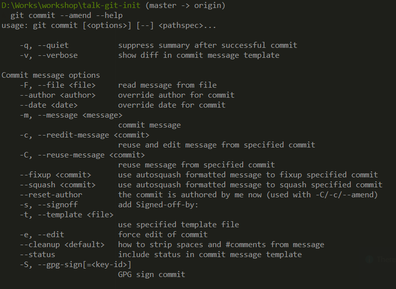

# Test to send workshop for github

## Git ammend

### How to remove added file

---
``git rm --cached file.txt ``

you could use to remove file from gitignore (try it)

---

### Starting to edit with --amend (the secret)
`` git commit --amend``

Add some file on last commit 

``git commit --amend --no-edit <file>``

Edit date time on last commit 

``git commit --amend --date "sadfasfdsda"``

Edit message on last commit 

``git commit --amend -m "new message"``

#### Other options

## Revert commits
### How to remove your commit but keeping hisorical context

``git revert <commitId>``

## Reset commits
## How to remove your commit without historical files

``git reset --soft <commitId>``

``git reset --hard <commitId>``

``git reset --soft HEAD^1``
